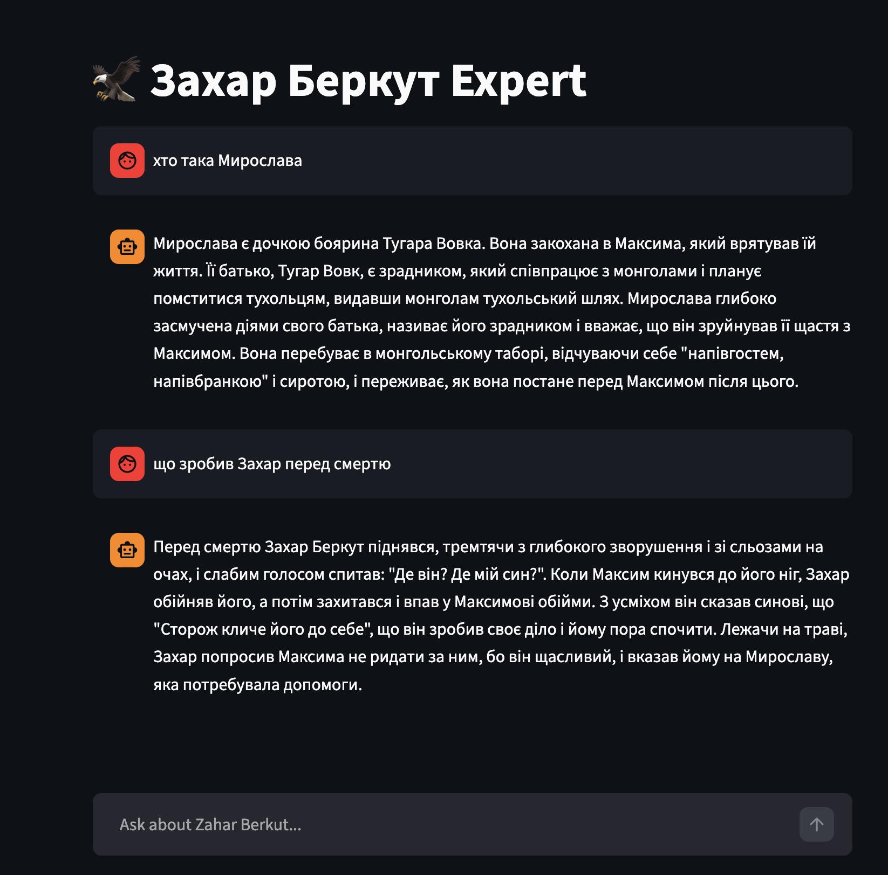

# Zahar Berkut Expert

This project implements a Retrieval-Augmented Generation (RAG) system to answer questions about Ivan Franko's "Захар Беркут" (Zakhar Berkut) using a Streamlit web interface. The application leverages Google's Gemini models for embeddings and language generation, and Qdrant for local vector storage.

## Architecture

The application follows a standard RAG architecture:

1.  **Document Loading**: The `full-text.pdf` document, containing the text of "Захар Беркут", is loaded using `PyPDFLoader`.
2.  **Text Splitting**: The loaded PDF is split into smaller, semantically coherent chunks using `RecursiveCharacterTextSplitter`. This ensures that relevant information is contained within individual chunks for effective retrieval.
3.  **Embedding Generation**: `GoogleGenerativeAIEmbeddings` (specifically the `gemini-embedding-2` model) is used to convert the text chunks into numerical vector representations.
4.  **Vector Storage**: The generated embeddings are stored in a local Qdrant vector database (`./qdrant_db`). This allows for efficient similarity search.
5.  **Retrieval Chain**:
    *   A `MultiQueryRetriever` is employed to enhance the retrieval process. For each user query, the LLM generates multiple rephrased queries, increasing the chances of finding relevant chunks in the vector store, especially for specific entities or complex questions.
    *   The retriever fetches the top 15 most similar data chunks from Qdrant.
6.  **Language Model (LLM)**: `ChatGoogleGenerativeAI` (using the `gemini-2.5-flash` model) processes the retrieved chunks and the user's question to generate a coherent and informative answer.
7.  **Web Interface**: Streamlit provides an interactive chat-based web interface for users to ask questions and receive answers. It manages session state to maintain conversation history and avoid re-embedding the document on every interaction.

## Setup and Installation

To set up and run the Zahar Berkut Expert application, follow these steps:

### Prerequisites

*   **Python 3.13**: Ensure you have Python 3.13 installed.
*   **uv**: This project uses `uv` as a fast Python package installer and manager. If you don't have it, install it:
    ```bash
    pip install uv
    ```
*   **Google AI API Key**: Obtain an API key from Google AI Studio.

### Environment Configuration

1.  **Create a `.env` file**: In the root directory of the project (`/Users/vrykhva/Dev/zahar-berkut-expert/`), create a file named `.env`.
2.  **Add your API Key**: Add your Google AI API key to the `.env` file:
    ```
    GOOGLE_API_KEY='your_actual_google_api_key_here'
    ```

### Running the Application

1.  **Navigate to the project directory**:
    ```bash
    cd /Users/vrykhva/Dev/zahar-berkut-expert/
    ```
2.  **Run the Streamlit application**: `uv` will automatically install the necessary dependencies (listed in the `main.py` script block) and then run the Streamlit app.
    ```bash
    uv run streamlit run main.py
    ```
3.  **Access the web interface**: Once the command runs, Streamlit will open the application in your web browser (usually at `http://localhost:8501`).

## Tools Used

*   **Python 3.13**
*   **uv**: Fast Python package installer and manager.
*   **Streamlit**: For building interactive web applications.
*   **LangChain**: Framework for developing applications powered by language models.
    *   `langchain-community`: For `PyPDFLoader`.
    *   `langchain-text-splitters`: For `RecursiveCharacterTextSplitter`.
    *   `langchain-google-genai`: For `GoogleGenerativeAIEmbeddings` and `ChatGoogleGenerativeAI`.
    *   `langchain-qdrant`: For `QdrantVectorStore`.
    *   `langchain_classic.chains` and `langchain_classic.retrievers.multi_query`: Specific LangChain components for retrieval and chain creation.
*   **pypdf**: For PDF parsing.
*   **python-dotenv**: For loading environment variables from a `.env` file.
*   **Qdrant**: Vector database for storing and searching embeddings.

## Screenshot

Here's a glimpse of the web interface in action:


